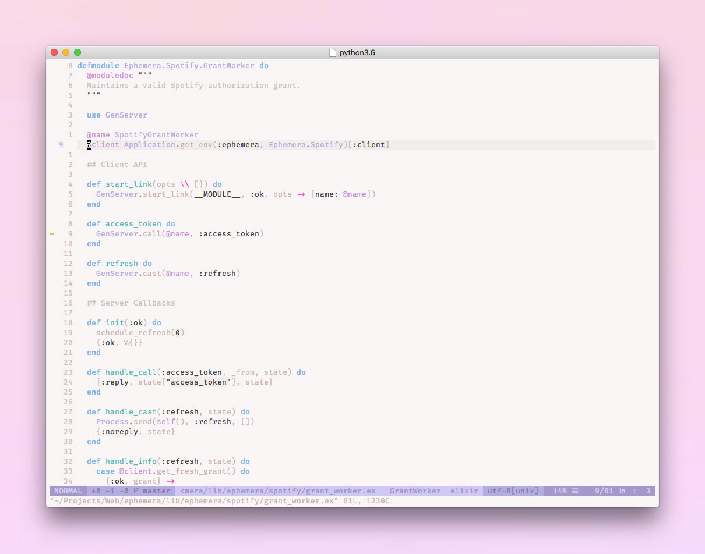

# \~ soft era \~

### syntax theme for [Vim](https://www.vim.org/)

🌸 Light pastel syntax theme for cozy, cute coding & typing. 🌱



## Installation

Install manually, or using the package manager of your choice:

```viml
" vim-plug
Plug 'soft-aesthetic/soft-era-vim'

" NeoBundle
NeoBundle 'soft-aesthetic/soft-era-vim'

" Vundle
Plugin 'soft-aesthetic/soft-era-vim'
```

Once installed, set the colorscheme in your configuration:

```viml
" Vim >=8.0 or Neovim >= 0.1.5
if (has("termguicolors"))
   set termguicolors
endif

" Neovim 0.1.3 or 0.1.4
let $NVIM_TUI_ENABLE_TRUE_COLOR=1

# Enable syntax highlighting and set colorscheme
syntax enable
colorscheme soft-era
```

You can use the included [vim-airline](https://github.com/vim-airline/vim-airline)
theme like:

```viml
let g:airline_theme = 'softera'
```

If you’re running Vim in [iTerm2](https://www.iterm2.com/), it’s *highly* recommended
to have a look at [soft era for iTerm2](https://github.com/soft-aesthetic/soft-era-iterm2).

## Roadmap

* [x] Base syntax
* [ ] CSS syntax
* [ ] Diff syntax
* [ ] Elixir syntax
* [ ] Fugitive syntax
* [ ] Git syntax
* [ ] Vim help syntax
* [ ] HTML syntax
* [ ] JavaScript syntax
* [ ] JSON sytax
* [ ] Markdown syntax
* [ ] NERDTree syntax
* [ ] Ruby syntax
* [ ] vim-gitgutter syntax
